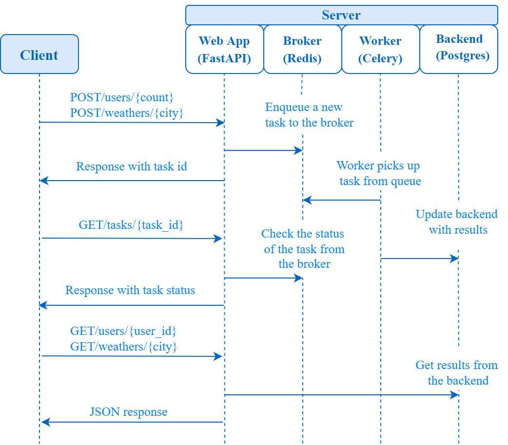

# FastAPI Celery Redis Postgres Docker REST API

### Summary:

This is simple REST API project using a modern stack with **[FastAPI](https://fastapi.tiangolo.com/)**.  
**[Celery](http://www.celeryproject.org/)** for background tasks  
**[Redis](https://redis.io/)** for the message broker  
**[PostgreSQL](https://www.postgresql.org/)** for the database  
**[SqlAlchemy](https://www.sqlalchemy.org/)** for ORM  
**[Docker](https://docs.docker.com/)** for containerization  
**[Docker Compose](https://docs.docker.com/compose/)** for defining and running multi-container  



---

### Endpoints Table:

| Request URL              | Description                                                                                         | HTTP |
| ------------------------ | --------------------------------------------------------------------------------------------------- | ---- |
| /users/{count}           | Get random user data from randomuser.me/api and add database using Celery. (Delay = 10 sec) | `POST` |
| /users/{count}/{delay}   | Get random user data from randomuser.me/api and add database using Celery.                  | `POST` |
| /users/{user\_id}        | Get user from database.                                                                             | `GET`  |
| /weathers/{city}         | Get weather data from api.collectapi.com/weather and add database using Celery. (Delay = 10 sec)    | `POST` |
| /weathers/{city}/{delay} | Get weather data from api.collectapi.com/weather and add database using Celery.                     | `POST` |
| /weathers/{city}         | Get weather from database.                                                                          | `GET`  |
| /tasks/{task\_id}        | Get task status.                                                                                    | `GET`  |

---

### Requirements:
* Docker and Docker Compose

### How to Run:

```
docker-compose up --build
```

### Example Requests:

---

#### Request:
```http request
POST /users/10
```

#### Response:
```json
{
    "task_id": "44178ce4-6f7a-4a6b-97fd-0de72a055360"
}
```

---

#### Request:
```http request
GET /users/5
```

#### Response:
```json
{
    "first_name": "Lorenzo",
    "last_name": "Domínguez"
}
```

---

#### Request:
```http request
POST /weathers/erzincan
```

#### Response:
```json
{
    "task_id": "46f5f77a-5fd7-41dd-898b-235d5def4a70"
}
```

---

#### Request:
```http request
GET /weathers/erzincan
```

#### Response:
```json
{
    "erzincan": [
        {
            "date": "08.10.2022",
            "day": "Cumartesi",
            "description": "orta şiddetli yağmur",
            "degree": 26.02
        },
        {
            "date": "09.10.2022",
            "day": "Pazar",
            "description": "hafif yağmur",
            "degree": 18.59
        },
        {
            "date": "10.10.2022",
            "day": "Pazartesi",
            "description": "açık",
            "degree": 17.85
        },
        {
            "date": "11.10.2022",
            "day": "Salı",
            "description": "açık",
            "degree": 17.49
        },
        {
            "date": "12.10.2022",
            "day": "Çarşamba",
            "description": "kapalı",
            "degree": 17.42
        },
        {
            "date": "13.10.2022",
            "day": "Perşembe",
            "description": "hafif yağmur",
            "degree": 19.42
        },
        {
            "date": "14.10.2022",
            "day": "Cuma",
            "description": "hafif yağmur",
            "degree": 16.37
        }
    ]
}
```

---

#### Request:
```http request
GET /tasks/46f5f77a-5fd7-41dd-898b-235d5def4a70
```

#### Response:
```json
{
    "state": "SUCCESS"
}
```

---

**Alperen Cubuk**